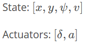
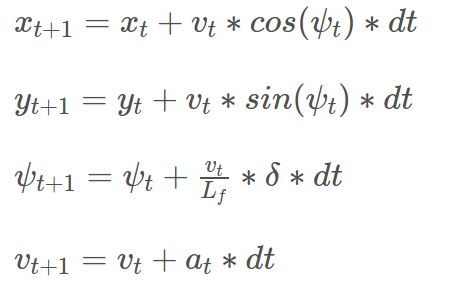
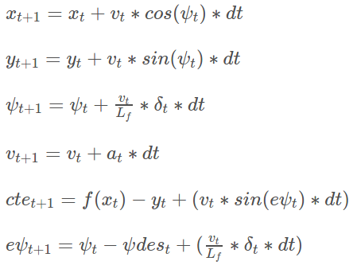

# CarND-Controls-MPC
Self-Driving Car Engineer Nanodegree Program

---

## Description

### Model

For the project a simple kinematic model was used. The state consists of four variables, namely x coordinate, y coordinate, heading direction and velocity.
The actuators consist of the steering angle and the acceleration (negative or positive). A summary is given in the image below.



For the update function the equations provided in the classroom were used.



### Time step & duration

To find suitable values for the hyperparameters N and dt, a target speed of 80 mph was set and kept constant. Then a target value for
T (N * dt) was determined by fixing dt to 0.1 and increasing N until the visualization of the predictions covered most of the visible road in front of the car without going to far into the horizon. 
T around 2 seconds seems to be a reasonable target value. The resulting values N=20 and dt=0.1 caused the car to oscillate.
In the next step I doubled N, reduced dt by halved (keeping T constant) and vice versa. N=40;dt0.05 made the oscillating even worse but N=10;dt0.2 already worked quite nicely.
After that I tried different values for 0 > N < 20 with the corresponding dt so that 2 = N * dt. In the end N=9;dt=0.22 worked best.

### MPC

For the MPC implementation the result of the _Model Predictive Control quiz_ was used as a starting point. To improve the controller lambda terms
were added to all the individual cost terms. This way each part of the cost function can be tuned individually to achieve smooth results.
The final lambda values are shown below.

```
const double LAMBDA_CTE = 2.0;
const double LAMBDA_EPSI = 3.0;
const double LAMBDA_V = 0.1;
const double LAMBDA_DELTA = 150.0;
const double LAMBDA_A = 0.2;
const double LAMBDA_DDELTA = 20.0;
const double LAMBDA_DA = 50.0;
```

The cost function definition is displayed below.

```
// The part of the cost based on the reference state.
for (int i = 0; i < N; i++) {
    fg[0] += LAMBDA_CTE * CppAD::pow(vars[IX_CTE_START + i] - REF_CTE, 2);
    fg[0] += LAMBDA_EPSI * CppAD::pow(vars[IX_EPSI_START + i] - REF_EPSI, 2);
    fg[0] += LAMBDA_V * CppAD::pow(vars[IX_V_START + i] - REF_V, 2);
}

// Minimize the use of actuators.
for (int i = 0; i < N - 1; i++) {
    fg[0] += LAMBDA_DELTA * CppAD::pow(vars[IX_DELTA_START + i], 2);
    fg[0] += LAMBDA_A * CppAD::pow(vars[IX_A_START + i], 2);
}

// Minimize the value gap between sequential actuations.
for (int i = 0; i < N - 2; i++) {
    fg[0] += LAMBDA_DDELTA * CppAD::pow(vars[IX_DELTA_START + i + 1] - vars[IX_DELTA_START + i], 2);
    fg[0] += LAMBDA_DA * CppAD::pow(vars[IX_A_START + i + 1] - vars[IX_A_START + i], 2);
}
```

For the contrains the equations from the classroom were used which are based on the kinematic model.




### Latency handling

To handle the simulated latency of 100 ms, the kinematic model was used to predict the cars position when receiving the command.
To do that the latency was converted to seconds and plugged into the _dt_ variable. This "delayed" state was then used as the base for all the calculations. 


---

## Dependencies

* cmake >= 3.5
 * All OSes: [click here for installation instructions](https://cmake.org/install/)
* make >= 4.1
  * Linux: make is installed by default on most Linux distros
  * Mac: [install Xcode command line tools to get make](https://developer.apple.com/xcode/features/)
  * Windows: [Click here for installation instructions](http://gnuwin32.sourceforge.net/packages/make.htm)
* gcc/g++ >= 5.4
  * Linux: gcc / g++ is installed by default on most Linux distros
  * Mac: same deal as make - [install Xcode command line tools]((https://developer.apple.com/xcode/features/)
  * Windows: recommend using [MinGW](http://www.mingw.org/)
* [uWebSockets](https://github.com/uWebSockets/uWebSockets)
  * Run either `install-mac.sh` or `install-ubuntu.sh`.
  * If you install from source, checkout to commit `e94b6e1`, i.e.
    ```
    git clone https://github.com/uWebSockets/uWebSockets 
    cd uWebSockets
    git checkout e94b6e1
    ```
    Some function signatures have changed in v0.14.x. See [this PR](https://github.com/udacity/CarND-MPC-Project/pull/3) for more details.
* Fortran Compiler
  * Mac: `brew install gcc` (might not be required)
  * Linux: `sudo apt-get install gfortran`. Additionall you have also have to install gcc and g++, `sudo apt-get install gcc g++`. Look in [this Dockerfile](https://github.com/udacity/CarND-MPC-Quizzes/blob/master/Dockerfile) for more info.
* [Ipopt](https://projects.coin-or.org/Ipopt)
  * Mac: `brew install ipopt`
  * Linux
    * You will need a version of Ipopt 3.12.1 or higher. The version available through `apt-get` is 3.11.x. If you can get that version to work great but if not there's a script `install_ipopt.sh` that will install Ipopt. You just need to download the source from the Ipopt [releases page](https://www.coin-or.org/download/source/Ipopt/) or the [Github releases](https://github.com/coin-or/Ipopt/releases) page.
    * Then call `install_ipopt.sh` with the source directory as the first argument, ex: `bash install_ipopt.sh Ipopt-3.12.1`. 
  * Windows: TODO. If you can use the Linux subsystem and follow the Linux instructions.
* [CppAD](https://www.coin-or.org/CppAD/)
  * Mac: `brew install cppad`
  * Linux `sudo apt-get install cppad` or equivalent.
  * Windows: TODO. If you can use the Linux subsystem and follow the Linux instructions.
* [Eigen](http://eigen.tuxfamily.org/index.php?title=Main_Page). This is already part of the repo so you shouldn't have to worry about it.
* Simulator. You can download these from the [releases tab](https://github.com/udacity/self-driving-car-sim/releases).
* Not a dependency but read the [DATA.md](./DATA.md) for a description of the data sent back from the simulator.


## Basic Build Instructions


1. Clone this repo.
2. Make a build directory: `mkdir build && cd build`
3. Compile: `cmake .. && make`
4. Run it: `./mpc`.

## Tips

1. It's recommended to test the MPC on basic examples to see if your implementation behaves as desired. One possible example
is the vehicle starting offset of a straight line (reference). If the MPC implementation is correct, after some number of timesteps
(not too many) it should find and track the reference line.
2. The `lake_track_waypoints.csv` file has the waypoints of the lake track. You could use this to fit polynomials and points and see of how well your model tracks curve. NOTE: This file might be not completely in sync with the simulator so your solution should NOT depend on it.
3. For visualization this C++ [matplotlib wrapper](https://github.com/lava/matplotlib-cpp) could be helpful.

## Editor Settings

We've purposefully kept editor configuration files out of this repo in order to
keep it as simple and environment agnostic as possible. However, we recommend
using the following settings:

* indent using spaces
* set tab width to 2 spaces (keeps the matrices in source code aligned)

## Code Style

Please (do your best to) stick to [Google's C++ style guide](https://google.github.io/styleguide/cppguide.html).

## Project Instructions and Rubric

Note: regardless of the changes you make, your project must be buildable using
cmake and make!

More information is only accessible by people who are already enrolled in Term 2
of CarND. If you are enrolled, see [the project page](https://classroom.udacity.com/nanodegrees/nd013/parts/40f38239-66b6-46ec-ae68-03afd8a601c8/modules/f1820894-8322-4bb3-81aa-b26b3c6dcbaf/lessons/b1ff3be0-c904-438e-aad3-2b5379f0e0c3/concepts/1a2255a0-e23c-44cf-8d41-39b8a3c8264a)
for instructions and the project rubric.

## Hints!

* You don't have to follow this directory structure, but if you do, your work
  will span all of the .cpp files here. Keep an eye out for TODOs.

## Call for IDE Profiles Pull Requests

Help your fellow students!

We decided to create Makefiles with cmake to keep this project as platform
agnostic as possible. Similarly, we omitted IDE profiles in order to we ensure
that students don't feel pressured to use one IDE or another.

However! I'd love to help people get up and running with their IDEs of choice.
If you've created a profile for an IDE that you think other students would
appreciate, we'd love to have you add the requisite profile files and
instructions to ide_profiles/. For example if you wanted to add a VS Code
profile, you'd add:

* /ide_profiles/vscode/.vscode
* /ide_profiles/vscode/README.md

The README should explain what the profile does, how to take advantage of it,
and how to install it.

Frankly, I've never been involved in a project with multiple IDE profiles
before. I believe the best way to handle this would be to keep them out of the
repo root to avoid clutter. My expectation is that most profiles will include
instructions to copy files to a new location to get picked up by the IDE, but
that's just a guess.

One last note here: regardless of the IDE used, every submitted project must
still be compilable with cmake and make./
